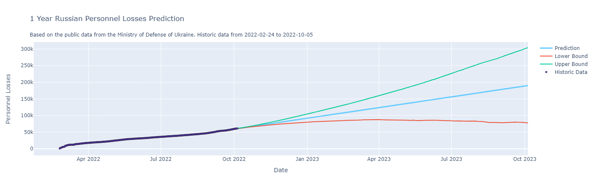
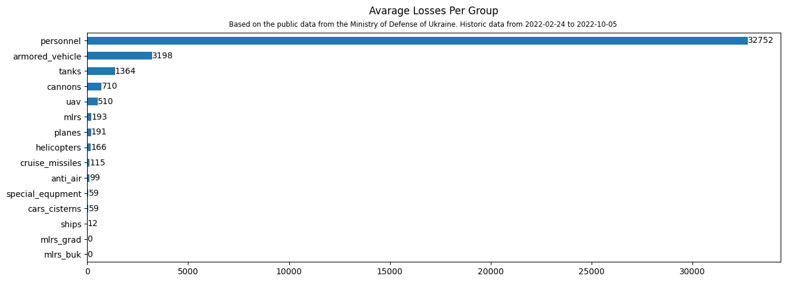

# Russian Ukraine War

[Donate to UNITED24](https://u24.gov.ua/) which was launched by the President of Ukraine Volodymyr Zelenskyy as the main venue for collecting charitable donations in support of Ukraine to stop russia illegal actions.
### Key Tekaways

- By October 2023, russian personnel losses may reach 190.000+ mark.
  - 300.000+ is an upper bound.
  - 77.000+ is a lower bound which very soon will be reached. As [per 2022-10-11 russian perssonel loses are 63.110+](https://www.mil.gov.ua/en/news/2022/10/11/the-total-combat-losses-of-the-enemy-from-24-02-to-11-10/).
- Top 3 losses groups are: personnel, armored vehicles, tanks.

### Project Goals

1. What is the avarage losses per day per each group?
2. How many personnel losses will be in a one year projection?
### Data Sources

Publicly available from the [Ministry of Defense of Ukraine](https://www.mil.gov.ua/en/) (News tab). Not an API, parsed by myself using own script.
### Analysis Methods

- Data cleaning.
- Explorary data analysis.
- Forecasting procedure using [Prophet](https://github.com/facebook/prophet).
### Tech Stack

- Python
  - refer to [`requriments.txt`](https://github.com/dimitryzub/russo-ukraine-war-prediction-losses/blob/7fe7eec9eee6d5da3eb0f701e9f3ab3883dc0667/requriments.txt) for all packages.

### Results

### What more could be done 

- Extract daily newly losses, not total per day.
- Answer the question: "what day has the most losses and why".
